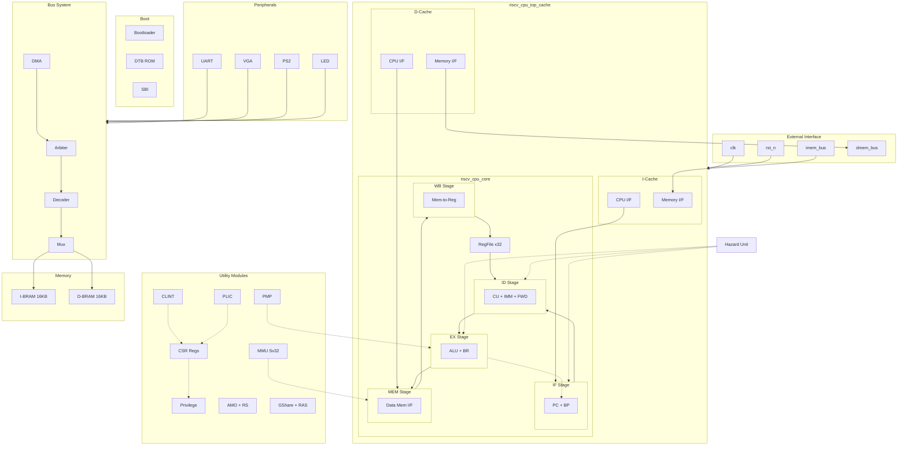
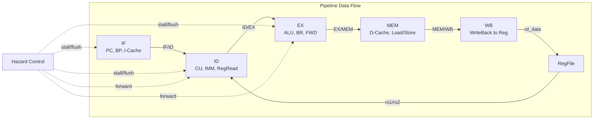
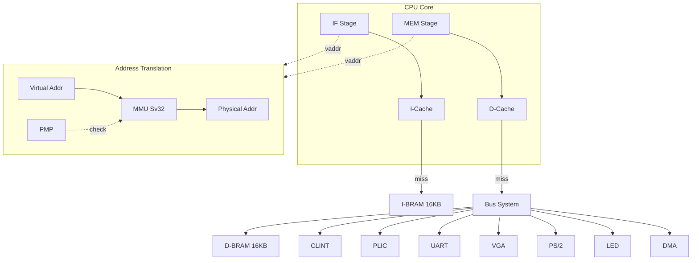

# new_cpu Architecture Diagram

## Top-Level Hierarchy

```mermaid
flowchart TD
    subgraph EXT["External Interface"]
        CLK["clk"]
        RST["rst_n"]
        IMEM["imem_bus"]
        DMEM["dmem_bus"]
    end

    subgraph TOP["riscv_cpu_top_cache"]
        subgraph ICACHE["I-Cache"]
            I_CPU["CPU I/F"]
            I_MEM["Memory I/F"]
        end

        subgraph DCACHE["D-Cache"]
            D_CPU["CPU I/F"]
            D_MEM["Memory I/F"]
        end

        subgraph CORE["riscv_cpu_core"]
            subgraph IF["IF Stage"]
                PC["PC + BP"]
            end

            subgraph ID["ID Stage"]
                CU["CU + IMM + FWD"]
            end

            subgraph EX["EX Stage"]
                ALU["ALU + BR"]
            end

            subgraph MEM["MEM Stage"]
                DMEM_IF["Data Mem I/F"]
            end

            subgraph WB["WB Stage"]
                MUX["Mem-to-Reg"]
            end

            RF["RegFile x32"]
        end
    end

    subgraph UTIL["Utility Modules"]
        CSR["CSR Regs"]
        MMU["MMU Sv32"]
        PMP["PMP"]
        PRIV["Privilege"]
        CLINT["CLINT"]
        PLIC["PLIC"]
        AMO["AMO + RS"]
        BP["GShare + RAS"]
    end

    subgraph BOOT["Boot"]
        BL["Bootloader"]
        DTB["DTB ROM"]
        SBI["SBI"]
    end

    subgraph PERIPH["Peripherals"]
        UART["UART"]
        VGA["VGA"]
        PS2["PS2"]
        LED["LED"]
    end

    subgraph BUS["Bus System"]
        ARB["Arbiter"]
        DEC["Decoder"]
        MUX_B["Mux"]
        DMA["DMA"]
    end

    subgraph MEMORY["Memory"]
        IBRAM["I-BRAM 16KB"]
        DBRAM["D-BRAM 16KB"]
    end

    %% Data flow
    CLK --> TOP
    RST --> TOP
    IMEM --> I_MEM
    D_MEM --> DMEM

    I_CPU --> IF
    D_CPU --> MEM

    IF --> ID
    ID --> EX
    EX --> MEM
    MEM --> WB
    WB --> RF
    RF --> ID

    %% Control signals
    EX -.-> PC

    HU["Hazard Unit"] -.-> IF
    HU -.-> ID
    HU -.-> EX

    CSR -.-> PRIV
    MMU -.-> MEM
    PMP -.-> EX

    CLINT -.-> CSR
    PLIC -.-> CSR

    UART --> BUS
    VGA --> BUS
    PS2 --> BUS
    LED --> BUS
    DMA --> ARB
    ARB --> DEC
    DEC --> MUX_B
    MUX_B --> IBRAM
    MUX_B --> DBRAM
```

## Five-Stage Pipeline Detail

```mermaid
flowchart LR
    subgraph PIPE["Pipeline Data Flow"]
        IF["IF
        PC, BP, I-Cache"] -->|IF/ID| ID["ID
        CU, IMM, RegRead"]
        ID -->|ID/EX| EX["EX
        ALU, BR, FWD"]
        EX -->|EX/MEM| MEM["MEM
        D-Cache, Load/Store"]
        MEM -->|MEM/WB| WB["WB
        WriteBack to Reg"]
        WB -->|rd_data| RF["RegFile"]
        RF -->|rs1/rs2| ID
    end

    HC["Hazard Control"] -.->|stall/flush| IF
    HC -.->|stall/flush| ID
    HC -.->|stall/flush| EX
    HC -.->|forward| EX
    HC -.->|forward| ID
```

## Memory and Bus Architecture

```mermaid
flowchart TD
    subgraph CPU["CPU Core"]
        IF["IF Stage"] --> ICache["I-Cache"]
        MEM["MEM Stage"] --> DCache["D-Cache"]
    end

    ICache -->|miss| IMem["I-BRAM 16KB"]
    DCache -->|miss| Bus["Bus System"]

    Bus --> DMem["D-BRAM 16KB"]
    Bus --> CLINT["CLINT"]
    Bus --> PLIC["PLIC"]
    Bus --> UART["UART"]
    Bus --> VGA["VGA"]
    Bus --> PS2["PS/2"]
    Bus --> LED["LED"]
    Bus --> DMA["DMA"]

    subgraph MMUSUB["Address Translation"]
        VA["Virtual Addr"] --> MMU["MMU Sv32"]
        MMU --> PA["Physical Addr"]
        PMP["PMP"] -.->|check| MMU
    end

    IF -.->|vaddr| MMUSUB
    MEM -.->|vaddr| MMUSUB
```
